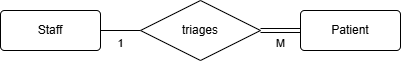

# Database Infomation

## Entities

* Patient
* Staff (also known as Administator)

## Relationship

The staff will categorize patients based on the severity of injuries and how long they are in the queue. The ERD is made in [diagrams.net](https://www.drawio.com).

## Attributes

* Patient
  - <ins>Patient ID</ins>: Integer
  - Name: String
  - Staff ID: Integer
  - Severity of injuries: Integer
  - Date of triage: Date
* Staff
  - <ins>Staff ID</ins>: Integer
  - Name: String